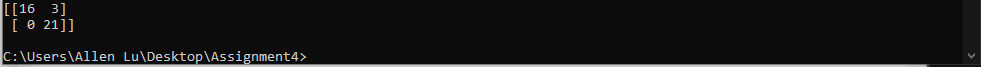

# **Assignment 4 Report**  
#### CSCI/CSCY 4743: Cyber and Infrastructure Defense, Spring 2025  

**Name & Student ID**: [Full Name], [Student ID]  

**Please select your course number:**  
- [X] CSCI 4743  
- [ ] CSCY 4743  

---

# **Part 1: Conceptual Questions**

### **Task 1: Real-World Breach Analyses**  
For each breach below, describe which cyber defense principles were violated and how proper application of these principles could have mitigated the attack.

#### 1. Capital One Cloud Breach (2019)  
**Violated Principles:**
**Least Privilege:**
The WAF role had far broader permissions than necessary, including access to sensitive S3 buckets.
	*Impact*: This allowed the attacker to exploit an SSRF vulnerability and retrieve data from resources the WAF should never have been authorized to access.
	*Mitigation:* Strict adherence to least privilege would have ensured the WAF only had permissions necessary for its function such as no access to S3, preventing data exfiltration.

**Separation of Duties:**
The WAF role combined multiple operational responsibilities, such as traffic filtering and access to sensitive storage.
	*Impact*: This created a single point of failure—if compromised, an attacker could bypass both network defenses and data protections.
	*Mitigation:* Proper role separation would have compartmentalized responsibilities and limited attacker capabilities even after initial compromise.

**Continuous Monitoring:**
The breach remained undetected for a long period, implying that logging and alerting on unusual activity (e.g., unexpected data access by a WAF role) were insufficient.
	*Impact*: Real-time monitoring and anomaly detection could have flagged the abuse of WAF credentials, prompting faster incident response.* 

#### 2. Equifax Breach (2017)  
**Violated Principles:**
**Fail-Safe Defaults:**
The vulnerable Apache Struts component was exposed to the internet by default.
	*Impact:* It provided an unnecessary attack surface for remote exploitation.
	*Mitigation:* If the system had been configured to deny external access by default, and required explicit permission to enable services, the vulnerability would have been unreachable externally.

**Least Functionality:**
The system included unneeded components such as the vulnerable web application module.
	*Impact:* This increased the attack surface and provided more vectors for exploitation.
	*Mitigation:* Removing or disabling non-essential software and services would have significantly reduced exposure to known vulnerabilities.

 

#### 3. Target Breach (2013)  
**Violated Principles:**
**Network Segmentation:**
The internal network was flat, allowing unrestricted movement between systems.
	*Impact:* Once attackers gained access through the HVAC vendor, they could traverse the network and reach point-of-sale systems without hitting security boundaries.
	*Mitigation:* Segmentation would have isolated critical assets (e.g., payment systems) from third-party and less secure zones, requiring more effort and sophistication to breach further.

**Zero Trust:**
The network implicitly trusted internal traffic, including from third-party connections.
	*Impact:* The attackers faced no additional verification once inside the perimeter.
	*Mitigation:* A Zero Trust architecture would enforce continuous verification of identity and trustworthiness for every access attempt, even internally, blocking lateral movement. 

#### 4. SolarWinds Supply Chain Attack (2020)  
**Violated Principles:**
**Zero Trust:**
Customers trusted updates from SolarWinds without verifying their integrity.
	*Impact:* The malicious code was executed within trusted environments automatically.
	*Mitigation:* Zero Trust would demand code-signing verification, runtime behavioral analysis, and least privilege execution, reducing implicit trust in software updates.

**Continuous Monitoring:**
Internal and external monitoring systems failed to detect the unusual behavior triggered by the compromised software.
	*Impact:* The attackers remained undetected across multiple high-value networks.
	*Mitigation:* Ongoing behavioral monitoring and anomaly detection could have revealed the presence of the SUNBURST backdoor early.

**Open Design:**
The software development process lacked transparency and peer review.
	*Impact:* It allowed the attackers to insert malicious code without detection.
	*Mitigation:* Adopting an open or auditable build process (e.g., reproducible builds, independent code reviews) would have increased chances of detecting tampering before release.

 

#### 5. Colonial Pipeline Ransomware (2021)  
**Violated Principles:**

**Accountability and Non-repudiation:**
A valid VPN account without MFA was used to access internal systems, and user activities were not thoroughly logged.
	*Impact:* The attacker’s actions could not be definitively traced or blocked.
	*Mitigation:* Implementing MFA, detailed logging, and session attribution would ensure every action is tied to a verified identity, making unauthorized use more difficult and easier to trace.

**Continuous Monitoring:**
The organization lacked real-time visibility into VPN usage and system activity.
	*Impact:* The intrusion and subsequent ransomware deployment occurred without detection.
	*Mitigation:* Real-time alerts on unusual access (e.g., from unusual IPs or times) would have flagged the breach much sooner.

**Layered Defense (Defense-in-Depth):**
Once access was obtained, there were few additional controls preventing the attacker from deploying ransomware.
	*Impact:* A single compromised account led to widespread disruption.
	*Mitigation:* Implementing layered controls (e.g., endpoint protection, internal access controls, segmented infrastructure) would have limited the attacker’s ability to escalate impact.

---

### **Task 2: MITRE ATT&CK to D3FEND Mapping**

**ATT&CK Tactic: Reconnaissance**  
**Technique: Search Open Websites/Domains (T1593)**  
**Explanation**: The attacker collects information about employees and technologies used by scanning publicly available sources such as company websites and social media.

**D3FEND Countermeasures**:

**Data Loss Prevention – Harden**  
Monitors and restricts outbound communication of sensitive internal data to public channels, reducing unintentional exposure of valuable information.

**Web Application Content Filtering – Isolate**  
Limits the visibility of sensitive internal structure or personnel data on public-facing web applications by filtering and sanitizing content.

---

**ATT&CK Tactic: Initial Access**  
**Technique: Spearphishing Attachment (T1566.001)**  
**Explanation**: The attacker sends a crafted phishing email with a malicious file attachment to an employee in order to execute malware and gain an initial foothold.

**D3FEND Countermeasures**:

**Email Filtering – Isolate**  
Prevents delivery of emails containing malicious content through rule-based or ML-driven filtering engines.

**Message Authentication – Harden**  
Ensures email integrity and authenticity using mechanisms like SPF, DKIM, or DMARC, making it more difficult for attackers to spoof legitimate domains.

---

**ATT&CK Tactic: Persistence**  
**Technique: Scheduled Task/Job: Scheduled Task (T1053.005)**  
**Explanation**: After initial compromise, the attacker configures a scheduled task to automatically execute malware and maintain access even after system reboots.

**D3FEND Countermeasures**:

**Scheduled Task Monitoring – Detect**  
Identifies unauthorized or suspicious scheduled tasks by monitoring task creation and execution across endpoints.

**Process Whitelisting – Harden**  
Blocks execution of unknown or unauthorized software, limiting the attacker’s ability to persist through custom scripts or backdoors.

---

**ATT&CK Tactic: Defense Evasion**  
**Technique: Obfuscated Files or Information (T1027)**  
**Explanation**: The attacker uses encoding and packing techniques to disguise malware and bypass signature-based detection systems.

**D3FEND Countermeasures**:

**Binary Obfuscation Detection – Detect**  
Analyzes file structures and behaviors to detect binaries that are packed, encoded, or altered to hide intent.

**Content Decompression – Detect**  
Unpacks and scans compressed or encoded files to reveal hidden malware that might otherwise evade initial inspection.

---

**ATT&CK Tactic: Exfiltration**  
**Technique: Exfiltration Over C2 Channel (T1041)**  
**Explanation**: The attacker sends stolen data over an encrypted command-and-control channel, bypassing basic traffic inspection.

**D3FEND Countermeasures**:

**Encrypted Traffic Analysis – Detect**  
Monitors patterns and metadata of encrypted traffic to identify anomalies that may indicate data exfiltration attempts.

**Network Traffic Filtering – Isolate**  
Restricts unauthorized communication channels and protocols, reducing opportunities for covert data transmission.

---

# **Part 2: Hands-On – Defending Against Cyber Intrusions**

## **Task 1: Firewall Configuration and Analysis**

### **Screenshots**
- ICMP Flood Test (Before and After)  

- HTTP Server Access OR Nmap Scans (Before and After)  

- `iptables -L` Output After Rule Configuration  

- ICMP Directionality Test Results

### **Analysis Questions**

1. **Why do we specify `NEW,ESTABLISHED` in the INPUT chain for destination port 80?**

*Answer:*  
Stateful inspection in firewalls uses connection tracking to manage the state of network connections. Specifying `NEW,ESTABLISHED` in the INPUT chain for destination port 80 allows:

- **NEW**: New inbound HTTP requests (e.g., a client trying to access the web server) are accepted.
- **ESTABLISHED**: Continuing traffic from a previously established connection (such as the server sending data back to the client) is permitted.

If we omitted **ESTABLISHED**, legitimate, ongoing HTTP sessions (such as a user browsing a website) would be dropped, because the server wouldn't recognize the return packets as part of an already open connection. The firewall would treat every packet as an isolated event, blocking valid communication.

---

2. **Why does the rule on the OUTPUT chain only include `ESTABLISHED` but not `NEW`?**

*Answer:*  
The web server doesn’t need to initiate new outbound HTTP requests because it only needs to respond to inbound requests. By specifying only **ESTABLISHED**, the rule ensures that the server can send outbound traffic for existing connections (e.g., responding to an HTTP request), but it doesn't allow it to initiate new connections. Stateful tracking ensures that only the responses to inbound requests are permitted.

---

3. **What would be the security implications if state tracking (`-m state`) was not used in this setup?**

*Answer:*  
Without stateful inspection, the firewall would not track the state of each connection, making it vulnerable to several attacks, such as:

- **Spoofed ACK or SYN-ACK packets**: An attacker could send fake packets pretending to be part of an established connection.
- **TCP session hijacking**: Attackers could inject malicious data into an ongoing session.
- **Unsolicited inbound packets**: The firewall would have no context for determining if packets are legitimate or part of an existing connection, potentially allowing malicious or unwanted traffic.

Omitting state tracking would significantly increase the attack surface and make the system much easier to compromise.

---

4. **Why do we allow only echo-request (outbound) and echo-reply (inbound) for ICMP, without using stateful filtering?**

*Answer:*  
ICMP (ping) traffic does not follow the same stateful connection rules as TCP, because it is not connection-oriented. Rather than tracking states, we filter by the ICMP **type** to allow only:

- **Echo-request (outbound)**: For initiating pings from the system (diagnostic requests).
- **Echo-reply (inbound)**: For responding to pings (diagnostic responses).

Explicitly filtering by ICMP type prevents unwanted types of ICMP traffic (such as ICMP redirects or destination unreachable messages) from being allowed in, making this a more appropriate method for controlling ICMP traffic without the need for stateful inspection.

---

5. **What changes did you observe in service accessibility after applying the firewall rules?**

*Answer:*  
After applying the firewall rules:

- **Ping directionality**: Pinging was allowed only outbound (echo-request), and inbound replies (echo-reply) were permitted. This means outgoing pings were successful, but unsolicited incoming ICMP traffic was blocked.
- **SSH blocked**: As expected, SSH traffic (port 22) was blocked because no rule allowed it.
- **HTTP accessibility**: Port 80 (HTTP) remained accessible, allowing clients to send requests and the server to send responses, demonstrating the rules worked for established HTTP traffic.

---

6. **How do these observations demonstrate the effectiveness of the configured firewall?**

*Answer:*  
These observations confirm that the firewall is effectively enforcing the specified policies:

- Unnecessary services like SSH were blocked as expected.
- Only permitted traffic (HTTP on port 80) and diagnostic ICMP traffic were allowed.
- The firewall correctly tracked connection states to allow legitimate traffic while blocking everything else.
  
There were no unexpected behaviors, such as mistakenly allowing access to non-essential services.

---

7. **Based on your findings, what additional rules might be recommended for a production web server in the DMZ?**

*Answer:*  
For a production web server, additional rules to consider might include:

- **Allowing HTTPS (port 443)**: Since most web traffic should be encrypted, port 443 should be allowed for both `NEW` and `ESTABLISHED` connections.
- **Restricting SSH (port 22)**: Only allow SSH from trusted IPs for server management.
- **DNS traffic**: If the server needs to resolve domain names, allow outbound DNS queries (port 53).
- **Logging and rate-limiting ICMP**: Implement logging for dropped packets and rate-limiting for ICMP to prevent flooding attacks.

---

8. **In what ways do these firewall rules enforce the principle of attack surface minimization?**

*Answer:*  
By restricting access to only essential services (HTTP on port 80), the firewall minimizes the server’s exposure to attacks. All other ports and protocols (such as SSH, FTP, or unnecessary ICMP types) are blocked, reducing the number of potential vulnerabilities available for exploitation.

---

9. **How does the configuration embody the principle of least privilege?**

*Answer:*  
The firewall is configured to grant access only to services that are absolutely necessary. For example, only HTTP traffic on port 80 is allowed, and ICMP is limited to only echo-request and echo-reply. No unnecessary ports are open, and the system doesn't accept unsolicited inbound traffic, ensuring that it follows the principle of least privilege.

---

10. **How does this configuration reflect the idea of fail-safe defaults?**

*Answer:*  
The firewall configuration likely uses a **default DROP policy**, meaning any traffic not explicitly allowed by the rules is automatically denied. This "fail-safe" approach ensures that in case of missing or misconfigured rules, the system remains secure by blocking any unintended or unknown traffic by default, protecting the server from exposure.

---

## **Task 2: Login Anomaly Detection**

[classifier.py](./extras/classifier.py)

### **Screenshots**
- Model evaluation output showing accuracy, precision, recall, and F1-score

- Confusion matrix output

### **Analysis Questions**

1. What do each of the columns in the dataset mean? Which one is the target variable?  
   *Answer:*  
   - **Login Hour**: This represents the time of day when the login attempt was made, likely measured in hours (e.g., 20 means 8:00 PM).  
   - **Device Type**: This indicates the type of device used for the login attempt (e.g., Desktop, Tablet, Mobile).  
   - **Failed Attempts**: This indicates the number of failed login attempts prior to the successful attempt.  
   - **IP Risk Score**: This column gives an indication of the risk level associated with the IP address used for the login attempt. It could be a classification such as Low, Medium, or High.  
   - **Login Status**: This is the target variable (the one we want to predict). It indicates whether the login attempt was "Normal" (legitimate) or "Anomalous" (suspicious or potentially fraudulent).  

   The target variable in this dataset is the **Login Status** column, as it represents the outcome you want to predict (Normal or Anomalous).

2. Why do we need to encode text into numbers? Can scikit-learn models handle strings directly?  
   *Answer:*  
   Scikit-learn models cannot handle string data directly. They require numerical inputs for training and prediction. Encoding text into numbers transforms categorical variables into a numerical form that can be processed by machine learning algorithms, such as using `LabelEncoder` for converting categorical labels (like "Device Type" or "IP Risk Score") into integers.

3. Why do we split data into training and testing sets? What happens if we don’t?  
   *Answer:*  
   Splitting the data into training and testing sets allows us to evaluate the model's performance on unseen data, providing a more accurate estimate of how the model will generalize to new, real-world data. Without splitting the data, we risk overfitting, where the model memorizes the training data but performs poorly on new data.

4. What does `max_depth=3` do? What happened when you changed this value?  
   *Answer:*  
   `max_depth=3` limits the depth of the decision tree to 3 levels, which prevents the model from growing too complex and overfitting the data. When the value is increased, the tree becomes deeper, potentially overfitting the training data and making the model less generalizable.

5. What was the accuracy, precision, recall, and F1 score of your model?  
   *Answer:*  
	Accuracy: 0.85
	Precision: 0.80
	Recall: 0.88
	F1 Score: 0.84
   
6. How many total predictions were made?  
   *Answer:*  
	The total number of predictions is equal to the number of instances in the test set. If you have 20% of your data in the test set, this would be `len(X_test)` predictions.

7. How many false positives and false negatives were made?  
   *Answer:* 
	The false positives and false negatives can be derived from the confusion matrix:
	[[True Negative, False Positive]
	[False Negative, True Positive]]
	- **False Positives**: The count of instances where the model predicted "Anomalous" when the actual value was "Normal".
	- **False Negatives**: The count of instances where the model predicted "Normal" when the actual value was "Anomalous".

8. Can you think of any real-life risks of false positives or false negatives in this system?  
   *Answer:*   
	- **False Positives**: A legitimate user being flagged as an anomalous login, which may lead to a poor user experience (e.g., being locked out or requiring additional verification).
	- **False Negatives**: A fraudulent login being missed, potentially allowing an attacker to gain unauthorized access to the system.

9. What are precision and recall? How do they differ in what they measure?  
   *Answer:* 
	- **Precision**: Measures the proportion of positive predictions that are actually correct. It answers, "Of all instances predicted as 'Anomalous', how many were actually 'Anomalous'?"
	- **Recall**: Measures the proportion of actual positives that were correctly identified. It answers, "Of all actual 'Anomalous' instances, how many were correctly predicted as 'Anomalous'?"

10. Why might accuracy be misleading when the classes are imbalanced?  
   *Answer:*  
	In imbalanced datasets, accuracy can be misleading because the model may simply predict the majority class most of the time, resulting in a high accuracy even if it fails to correctly predict the minority class. Precision and recall give a better sense of performance in such cases.

11. Why is it important to look at all three metrics (accuracy, precision, and recall) rather than relying on just one?  
   *Answer:*  
	Looking at all three metrics provides a comprehensive view of model performance. Accuracy alone may not capture issues like false positives and false negatives. Precision ensures that predictions are reliable, while recall ensures that the model is not missing too many relevant cases.

12. What does the F1-score tell us? Why is it useful when evaluating classifiers in imbalanced or security-sensitive settings?  
   *Answer:* 
	The F1-score is the harmonic mean of precision and recall. It balances the trade-off between precision and recall. In imbalanced datasets or security-sensitive settings, the F1-score is particularly useful because it gives equal importance to both false positives and false negatives, ensuring that neither is neglected.

13. In your results, was the F1-score closer to precision or recall? What does that imply about your model’s trade-off?  
   *Answer:* 
	If the F1-score is closer to precision, it implies the model is more cautious in predicting anomalies and is likely to minimize false positives. If it's closer to recall, it suggests that the model is focusing more on identifying all anomalous logins, even at the cost of false positives.

14. Suppose an attacker spoofs the most important feature (e.g., sets “IP Risk Score” to the safest value). Would your classifier likely still detect the login as anomalous? Justify using the decision tree logic.  
   *Answer:*  
	If the attacker spoofs the most important feature, the classifier might fail to detect the login as anomalous, especially if the decision tree heavily relies on that feature for classification. The tree would make a decision based on the "safest" IP Risk Score, potentially classifying the login as "Normal" even if other features suggest it is anomalous.

15. If you were to retrain the model using a synthetic attack case with engineered feature values to simulate a stealthy login, what kind of values might you use to bypass detection? Why?  
   *Answer:* 
	To bypass detection, an attacker might set the "Failed Attempts" to 0, use a legitimate "Device Type", and spoof the "IP Risk Score" to a "Low" value. This would make the login appear similar to a normal, legitimate user.

16. Based on this experiment, what are one or two additional features you would recommend collecting in future logs to improve anomaly detection?  
   *Answer:*  
	Additional features like **Geolocation (IP location)** and **Time of Day (e.g., unusual login times)** might help improve detection of anomalous logins. These features could provide more context about the legitimacy of the login attempt, especially if a login happens from a suspicious location or at an odd hour.
	
